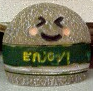
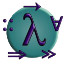
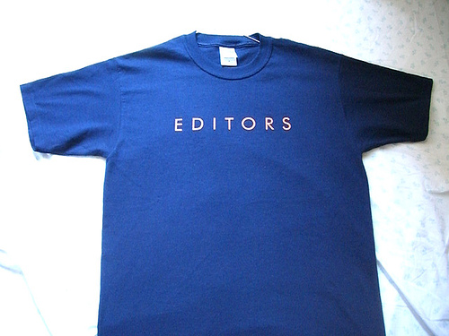

# CairoでほっかりGUIプログラミング

Kiwamu Okabe

# 自己紹介

* twitter: http://twitter/master_q
* 職業: コピペプログラマ
* ふだんはDebian使い
* Haskellは本腰入れて勉強しはじめて半年

# 「Haskell」への周囲の反応

うちの会社の近辺では。。。

* 何がいいの？
* Haskellで何ができるの？
* 実用になるの？
* 製品に使えるの？

# できますって!

やる気になれば!

# じゃーなんか作りましょうよ

* ゲームとか作れば釣れる？
* とにかくGUIで、なんか。。。

# あ、今日プレゼンやるDEATH

* じゃープレゼンツール作りましょう!
* http://rabbit-shockers.org みたいなの!
* 。。。できました!

https://gitorious.org/carettah ← コレ

# こんなん作ってみました

画像で説明セヨ!!!!!!!!!!!!!!

# 使い方: プレゼンテキスト書式

↓みたいなテキストファイルを作って

~~~ { .markdown }
# CairoでほっかりGUIプログラミング

Kiwamu Okabe
# 自己紹介

* twitter: http://twitter/master_q ...
~~~

ファイル名sample.mdで保存。

# 使い方: 起動

さっき書いたテキストを食わせるだけ

~~~ { .command }
$ pwd
/home/hogehoge/src/carettah
$ ./carettah sample.md
~~~

すればプレゼン開始。
